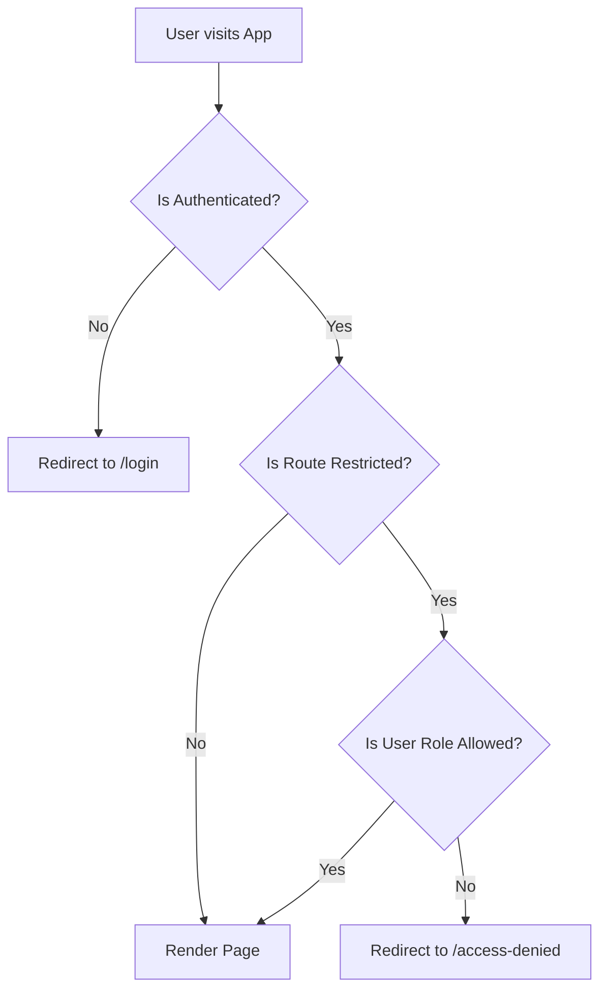

# Role-Based Access Control (RBAC) System

A clean and professional implementation of a client-side Role-Based Access Control (RBAC) system in a React application using Redux Toolkit.

---

## 1. Directory Structure

The project strictly follows the requested structure:

```text
src/
├── app/
│   └── store.js            # Redux store configuration
├── features/
│   └── auth/
│       ├── authSlice.js    # Redux slice for auth state, actions, and selectors
│       └── authService.js  # Mock API service representing authentication routines
├── routes/
│   └── ProtectedRoute.jsx  # Reusable route guard for authentication & authorization
├── pages/
│   ├── Login.jsx           # User sign-in page with quick fill demo accounts
│   ├── Dashboard.jsx       # General statistics & activity log dashboard
│   ├── AdminPanel.jsx      # Admin table user roster & permissions matrix
│   ├── ManagerPanel.jsx    # Manager views for Team, Reports, & Permissions
│   ├── EmployeeProfile.jsx # Employee details & active token check
│   └── AccessDenied.jsx    # 403 Access Denied fallback page
├── components/
│   └── Navbar.jsx          # Role-filtered left sidebar navigation menu
└── utils/
    └── roles.js            # Unified constants for roles and navigation config
```

---

## 2. Authentication & Authorization Flow



### Authentication Routine
1. **Sign In:** The user inputs credentials on the login form. The `loginUser` async thunk dispatches a login action to `authService.login()`.
2. **Session Generation:** Upon verification, a simple mock session token (`mock-token-[id]-[role]`) and user meta details are returned and stored in the Redux store.
3. **Persistence:** The token and user details are written to `localStorage` to persist across page refreshes.
4. **Session Restore:** On application startup, `initialState` retrieves details from `localStorage`, preserving login status.
5. **Sign Out:** The `logoutUser` action resets the Redux auth state and removes key values from `localStorage`.

### Authorization & Guard Routine
1. **ProtectedRoute Wrapper:** Protected paths are wrapped in `<ProtectedRoute allowedRoles={[...]}>` inside `App.jsx`.
2. **Validation:**
   * If the user is not logged in, they are redirected to `/login`.
   * If the user's role is not included in the allowed roles array for that route, they are blocked and redirected to the `/access-denied` (403) page.
3. **Role-Based Side Navigation:** Nav options are filtered inside `Navbar.jsx` using the `NAV_ITEMS` definition. Users only see navigation options they have permission to access.

---

## 3. Route Permission Matrix

The application handles pages, sidebar visibility, and route access restriction dynamically:

| Path | Component | Allowed Roles | Sidebar Visibility |
| :--- | :--- | :--- | :--- |
| `/login` | `Login` | Public | None (Stand-alone page) |
| `/access-denied` | `AccessDenied` | Public | None (Error page) |
| `/dashboard` | `Dashboard` | Admin, Manager, Employee | Visible to all logged-in users |
| `/admin` | `AdminPanel` | Admin | Visible to Admins only |
| `/manager` | `ManagerPanel` | Admin, Manager | Visible to Admins and Managers |
| `/profile` | `EmployeeProfile` | Admin, Manager, Employee | Visible to all logged-in users |

---

## 4. Demo Credentials

Quick fill accounts are available on the Login screen:

| Username | Password | Role | Access Level |
| :--- | :--- | :--- | :--- |
| `admin` | `admin123` | **Admin** | Dashboard, Admin Panel, Manager Panel, Profile |
| `manager` | `manager123` | **Manager** | Dashboard, Manager Panel, Profile |
| `employee` | `employee123` | **Employee** | Dashboard, Profile |
